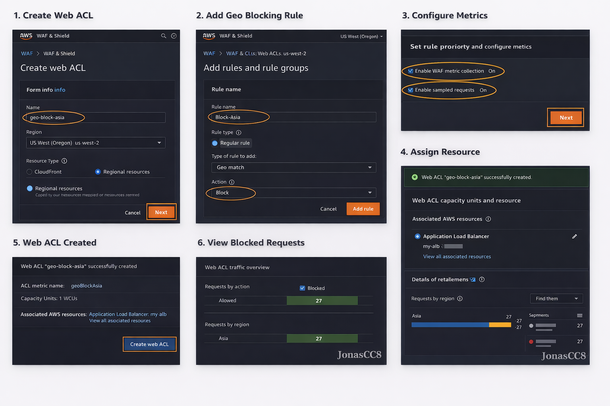

# 🌍 AWS WAF – Bloqueo Geográfico de Región Asia

## 📖 Descripción General

Este proyecto demuestra cómo configurar AWS WAF (Web Application Firewall) para bloquear tráfico proveniente del continente Asia utilizando una regla geográfica (Geo Match Rule).

La implementación se realizó en la región:

📍 us-west-2 (Oregon)

El objetivo es reducir la superficie de ataque restringiendo tráfico desde regiones donde la aplicación no opera.

---

## 🎯 Objetivo del Laboratorio

- Crear una Web ACL en AWS WAF
- Configurar una regla geográfica
- Bloquear tráfico proveniente de Asia
- Asociar la Web ACL a un Application Load Balancer o CloudFront
- Habilitar monitoreo en CloudWatch

---

## 🏗️ Arquitectura

Internet Traffic  
↓  
AWS WAF (Geo Match Rule – Block Asia)  
↓  
Application Load Balancer / CloudFront  
↓  
Aplicación Web  

---

## ⚙️ Implementación Paso a Paso

### 1️⃣ Crear Web ACL

- Servicio: AWS WAF & Shield
- Región: us-west-2
- Nombre: `geo-block-asia`
- Tipo de recurso: Regional (ALB) o CloudFront

---

### 2️⃣ Crear Regla Geográfica

Tipo de regla: Regular rule  
Statement: Geo match rule  

Configuración:
- Seleccionar continente: Asia
- Acción: Block

Nombre de la regla:
`block-asia-traffic`

---

### 3️⃣ Configurar Métricas

- Habilitar CloudWatch metrics
- Habilitar Sampled requests

Esto permite monitorear tráfico bloqueado.

---

### 4️⃣ Asociar Recurso

Asociar Web ACL a:

- Application Load Balancer
o
- Distribución CloudFront

---

## 🔐 Seguridad Aplicada

- Reducción de superficie de ataque
- Control geográfico basado en ubicación IP
- Implementación bajo principio de mínimo privilegio
- Monitoreo habilitado en CloudWatch

---

## 📊 Monitoreo

Desde la consola:

WAF → Web ACL → Monitoring

Se pueden visualizar:

- Requests allowed
- Requests blocked
- Origen geográfico del tráfico
- Métricas en tiempo real

---

## 🧠 Consideraciones Técnicas

- Geo Match se basa en base de datos de geolocalización de IP
- Puede complementarse con:
  - Rate limiting rules
  - Managed rule groups
  - Protección contra SQL Injection y XSS
- Se recomienda combinar con AWS Shield para protección DDoS
